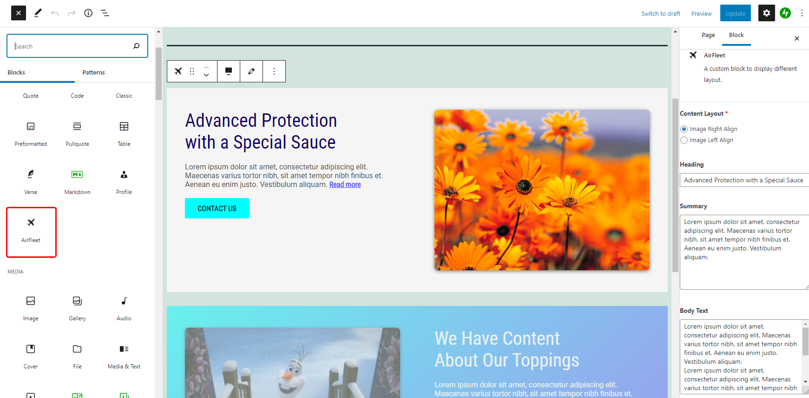

# Airfleet Block

Created a new child theme from [Twenty Twenty-One](https://wordpress.org/themes/twentytwentyone/) and added a Airfleet custom block using [ACF Pro](https://www.advancedcustomfields.com/pro/).

## Block Detail
The main goal is to create a Gutenberg block that supports two different views according to the design. Check Figma design [here](https://www.figma.com/file/xI9JqY0mp2xBMj6W5jzI0L/ACF_Gutenberg-Block).


Users can choose each view in the block properties in the WP admin dashboard.
And it should be pixel perfect and responsive for multiple screens and enable users to edit contents and values on the editor.

## Specification

Prerequisites:

* Check you have already installed [Twenty Twenty-One](https://wordpress.org/themes/twentytwentyone/).
* Check you have already installed [ACF Pro](https://www.advancedcustomfields.com/pro/) plugin.

Used:

* Bootstrap
* jQuery
* SCSS
* ACF Pro

## Running

* Download this as a zip file.
* Upload this theme file and Install/Activate on WordPress admin dashboard.
* Use block in Gutenberg editor.



## Development

```bash
# Install the dependencies.
$ cd .
$ npm install
```

* In functions.php, register a new block name under custom_acf_init_blocks() function.
* In custom-blocks folder, create a new folder with block name and add files (php for callback or template, javascript, scss for stylesheet, json for acf custom fields group)
